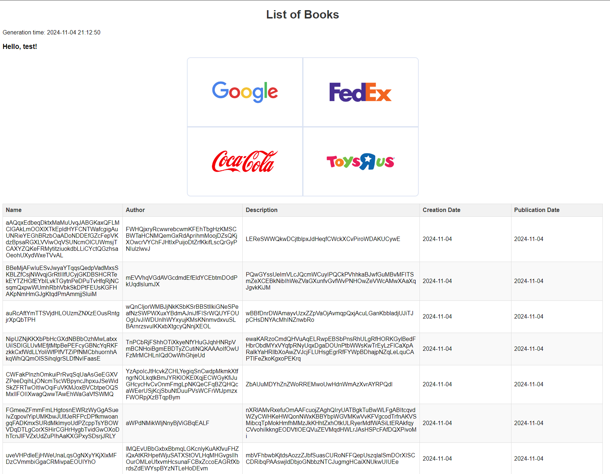
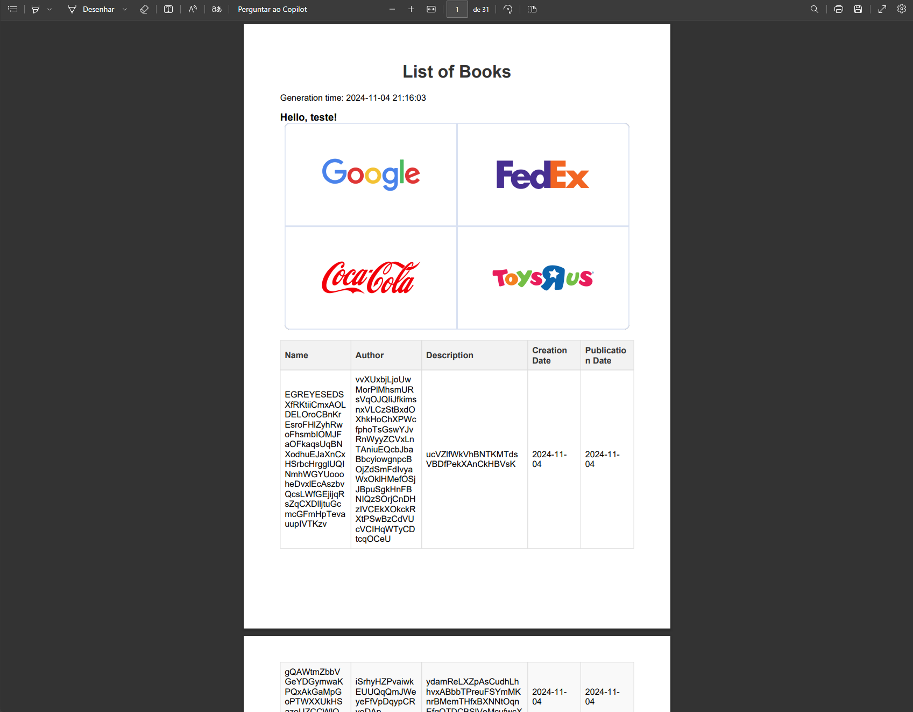

# spring-thymeleaf

An API developed for example of:

- Template generation
- Base64 PDF generation
- Internalization
- Code generation with Swagger Codegen

---

## Setup

- Java 21+

Required generate swagger code running:

```shell
mvn clean install -DskipTests
```

Then reload the project to reflect the generated code.

---

## Documentation

- [postman collection](docs/spring-thymeleaf.postman_collection.json)
- [swagger](src/main/resources/openapi/v1.yaml), accessible from `http://localhost:<port>/swagger-ui.html`]

---

## Preview

HTML Preview:


PDF Preview:

